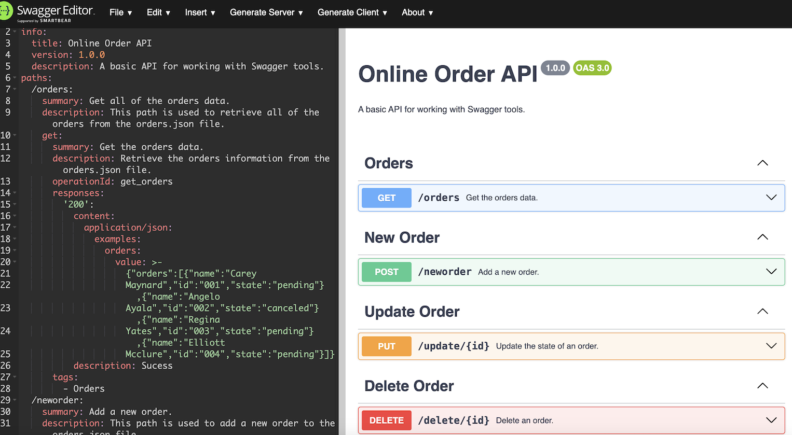

# swagger-api
Codecademy project to learn how to design and document an API using Swagger.

# Objectives Completed
- To utilize Swagger Editor to design an API contract using the OpenAPI specification and YAML
- To utilize Swagger UI to generate API documentation
- To use an API contract to create a working RESTful API

# Project Preview
A preview of Swagger UI on right generated by YAML API contract on left
